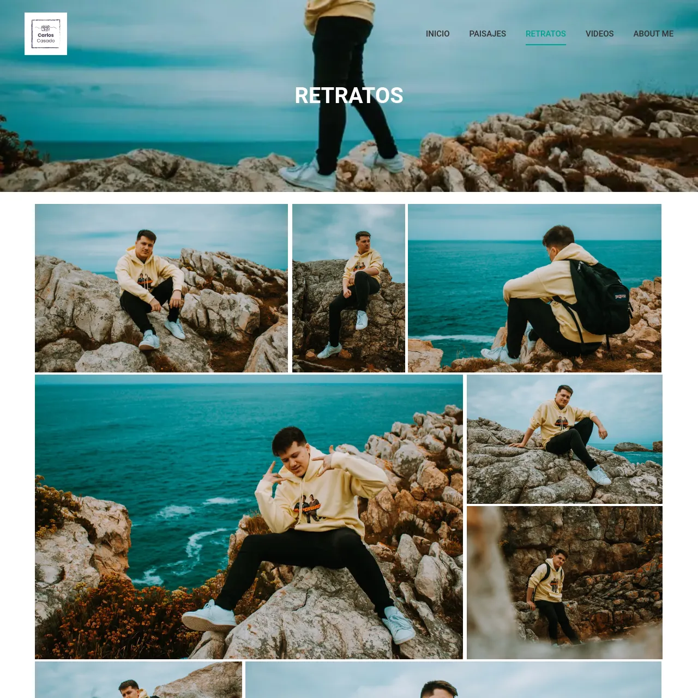
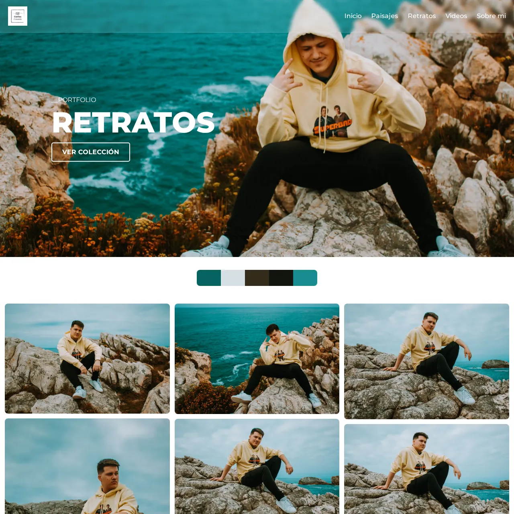
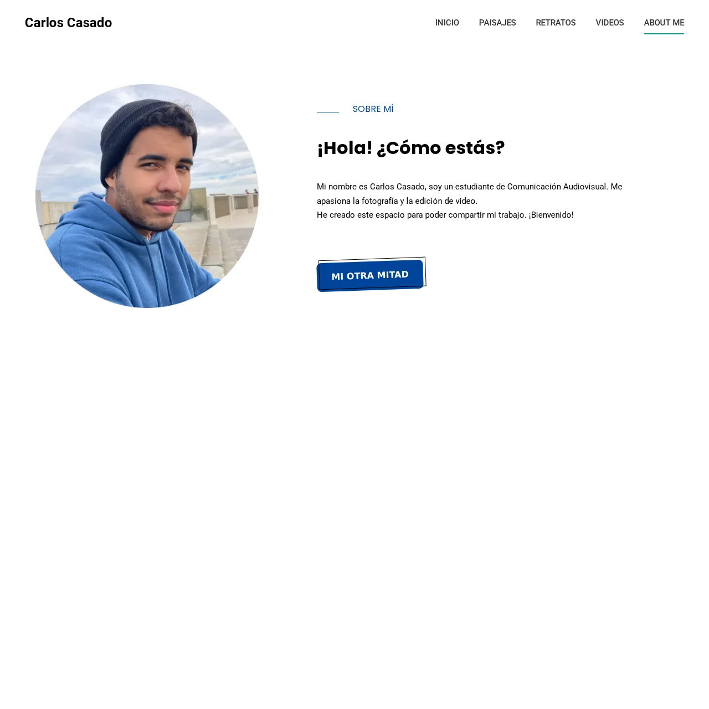
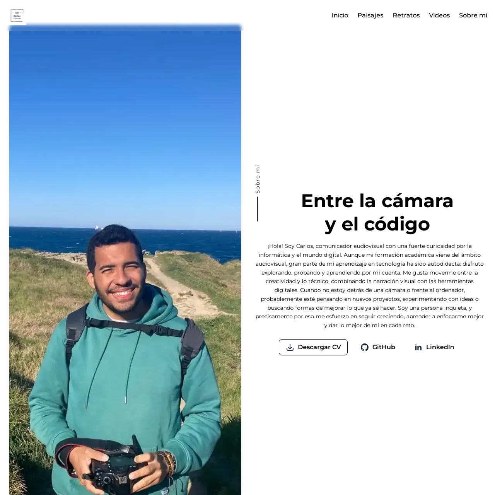
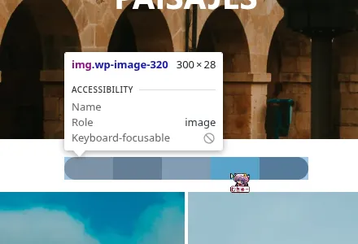
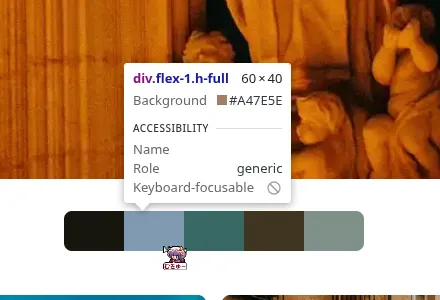

# Carlos Casado - Portfolio

Un portfolio web moderno y elegante que presenta mi trabajo como comunicador audiovisual y fotógrafo; mi principal inspiración proviene de mi sitio web original desarrollado en WordPress, manteniendo la misma esencia visual y conceptual pero implementándolo con tecnologias web modernas para un mayor control y personalización.

- **Portfolio HTML:** [new.carloscasado.es](https://new.carloscasado.es/)

## 🔗 Enlaces del Proyecto

| Versión | URL | Tecnología |
|---------|-----|------------|
| **Original** | [carloscasado.es](https://carloscasado.es/) | WordPress |
| **Actual** | [new.carloscasado.es](https://new.carloscasado.es/) | HTML5 + Tailwind CSS |

## 📸 Comparación Visual

### Evolución del Diseño: WordPress vs HTML

| WordPress | HTML |
|-----------|------|
|  |  |
| *Versión original con Wordpress* | *Nueva implementación con HTML5 + Tailwind CSS* |

Una de las principales diferencias es en el hero de las secciones, en el cual destaca más y juega un poco con el contenido dentro de ella.

| WordPress | HTML |
|-----------|------|
|  |  |
| *Versión original con Wordpress* | *Nueva implementación con HTML5 + Tailwind CSS* |

Él sobre mí cobra más vida al ocupar toda la página, sumado a un **formulario de contacto** al final del mismo.

| WordPress | HTML |
|-----------|------|
|  |  |
| *Versión original con Wordpress* | *Nueva implementación con HTML5 + Tailwind CSS* |

Otra de las diferencias son los colores pantone de las galerías, que anteriormente eran imágenes que conformaban un peso, por más mínimo que sea en la carga de la página; eran un factor de optimización a tomar en cuenta.

```
<div class="flex justify-center mt-8">
    <div class="w-full max-w-[300px] flex flex-row gap-0 h-10 rounded-lg overflow-hidden">
        <div class="flex-1 h-full" style="background-color: #17160D;"></div>
        <div class="flex-1 h-full" style="background-color: #A47E5E;"></div>
        <div class="flex-1 h-full" style="background-color: #386964;"></div>
        <div class="flex-1 h-full" style="background-color: #3E3521;"></div>
        <div class="flex-1 h-full" style="background-color: #7F9189;"></div>
    </div>
</div>
```

Por lo que ahora son bloques con un color de fondo; y que realmente trae otro beneficio, el cual se puede apreciar el color con mucha mayor resolución y sin pérdida.

## 📋 Descripción

Este proyecto es un portfolio personal que exhibe tres categorías principales:
- **Paisajes**: Fotografía de naturaleza y escenarios únicos
- **Retratos**: Fotografía artística y emocional de personas
- **Vídeos**: Creatividad audiovisual y storytelling

## 🎨 Decisiones de Diseño

### Paleta de Colores

La elección cromática se fundamenta en **paletas extraídas directamente de las fotografías** del portfolio, creando una coherencia visual orgánica y auténtica:

#### Colores Principales
- **Blancos y Grises**: Base neutra que permite que las fotografías sean protagonistas
- **Transparencias y Blur**: Efectos glassmorphism para elementos de interfaz modernos

**Justificación:** Estas paletas emergen del análisis cromático de las propias fotografías, garantizando que el diseño web sea una extensión natural del trabajo artístico mostrado.

### Tipografía

#### **Montserrat** - Tipografía Principal
- **Uso:** Textos de cuerpo, navegación y elementos de interfaz
- **Justificación:** Sans-serif moderna y legible que aporta:
  - Excelente legibilidad en pantallas
  - Carácter contemporáneo y profesional
  - Amplia gama de pesos (100-900)
  - Versatilidad para textos largos y elementos UI

### Filosofía Visual

#### **Minimalismo Fotográfico**
- **Espacios en blanco abundantes** para que las imágenes respiren
- **Layouts limpios** que no compitan con el contenido fotográfico
- **Jerarquía visual clara** que guía la atención hacia el trabajo artístico

#### **Glassmorphism y Modernidad**
- **Efectos de transparencia** (`backdrop-blur`, `bg-white/10`) en navegación
- **Bordes sutiles** (`border-white/20`) para definir elementos sin agresividad
- **Transiciones suaves** que mejoran la experiencia de usuario

#### **Responsividad Nativa**
- **Mobile-first approach** con Tailwind CSS
- **Grids adaptativos** que reorganizan contenido según el dispositivo
- **Imágenes optimizadas** con lazy loading y formato WebP

### Estructura Visual

#### **Hero Sections**
- **Altura variable** (100vh en inicio, 50vh en secciones) para crear jerarquía
- **Overlay de contenido** centrado con tipografía bold y uppercase
- **Call-to-action** claro con botones de estilo outline

#### **Galerías**
- **Grid de Masonry** adaptativo que respeta las proporciones originales
- **Lightbox integrado** con Alpine.js para experiencia inmersiva
- **Paletas cromáticas** mostradas como elementos decorativos entre secciones

#### **Navegación**
- **Header fijo** con transparencia que se adapta al contenido
- **Indicadores de sección activa** para orientación del usuario
- **Hamburger menu** responsive con animaciones suaves

## 🛠️ Tecnologías Utilizadas

- **HTML5**
- **CSS3**
- **Tailwind CSS** para diseño responsive
- **Alpine.js** para interactividad ligera
- **Flowbite** para componentes específicos
- **Alpine Tailwind Lightbox** para galerías

## 📱 Características

- Diseño responsive
- Carga lazy de imágenes
- Lightbox para visualización de fotografías
- Formulario de contacto funcional
- Paletas cromáticas como elemento visual

## 🎯 Objetivos del Diseño

1. **Protagonismo del contenido fotográfico** sobre elementos decorativos
2. **Coherencia visual** entre diseño web y trabajo artístico
3. **Experiencia fluida** en todos los dispositivos
4. **Carga rápida** y optimización técnica
5. **Identidad visual sólida** que refleje el estilo de las fotos

## ⚠️ Detalles pendientes

- Añadir las páginas sobre los aspectos legales.
- Mejorar los contrastes del menú.